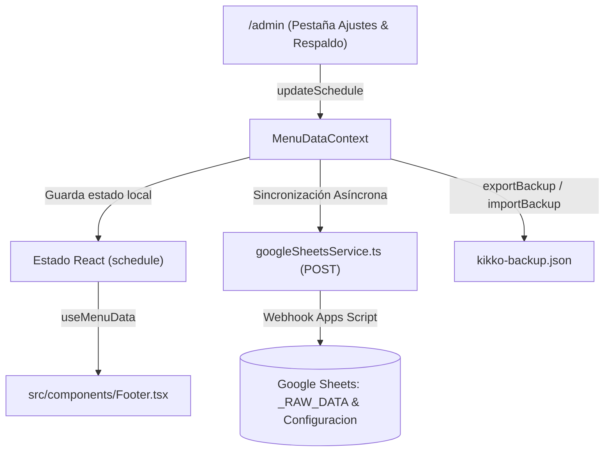

# Documento de Diseño: Gestor Dinámico de Horarios de Apertura en /admin y Pie de Página

**Fecha:** 17 de Septiembre de 2026  
**Proyecto:** Kikko Carta Digital Gourmet  
**Área:** Panel de Administración (`/admin`), Contexto de Menú (`MenuDataContext`), Sincronización en Nube (`Google Sheets`) y Pie de Página (`Footer.tsx`).  
**Estado:** Aprobado por el usuario — Listo para Plan de Implementación.

---

## 1. Contexto y Objetivos

Actualmente, los horarios mostrados en el pie de página de la carta pública (`src/components/Footer.tsx`) están estáticos en código (`footerWeek`: "Lunes - Domingo" / "12:30 - 21:30").
El objetivo de esta implementación es dotar al administrador de autonomía total para:
1. Configurar, añadir, modificar y eliminar turnos y líneas de horarios a su antojo desde `/admin`.
2. Soportar múltiples líneas horarias (ej. turnos de diario, fines de semana o días específicos de descanso/cierre).
3. Mantener el soporte trilingüe nativo (Español, Inglés e Italiano) mediante presets predefinidos y botón de auto-traducción en 1 clic.
4. Sincronizar los cambios en tiempo real con Google Sheets, protegerlos en copias de seguridad JSON y respetarlos en el Modo Sandbox.
5. Corregir la adaptabilidad visual en pantallas móviles para que los horarios nunca se desborden ni queden cortados.

---

## 2. Modelo de Datos (`src/types.ts`)

```typescript
export interface ScheduleItem {
  id: string; // Identificador único (ej. 'sched_1', 'sched_1789650000')
  days: {
    es: string; // ej. "Lunes - Jueves", "Viernes - Domingo", "Martes"
    en: string; // ej. "Monday - Thursday", "Friday - Sunday", "Tuesday"
    it: string; // ej. "Lunedì - Giovedì", "Venerdì - Domenica", "Martedì"
  };
  hours: string; // ej. "12:30 - 21:30" o "13:00 - 16:00 y 19:30 - 23:00"
  isClosed?: boolean; // Booleano para destacar si el local está cerrado en esa franja
}

export interface ScheduleConfig {
  items: ScheduleItem[];
  updatedAt?: string;
}
```

### Valores por Defecto Iniciales
```typescript
export const defaultScheduleConfig: ScheduleConfig = {
  items: [
    {
      id: 'sched_default_1',
      days: {
        es: 'Lunes - Domingo',
        en: 'Monday - Sunday',
        it: 'Lunedì - Domenica'
      },
      hours: '12:30 - 21:30',
      isClosed: false
    }
  ]
};
```

---

## 3. Arquitectura y Flujo de Datos



### 3.1. Estado y Métodos en `MenuDataContext.tsx`
- Nuevo estado: `schedule: ScheduleConfig` inicializado con `defaultScheduleConfig`.
- Nuevo método expuesto en `MenuDataContextType`:
  `updateSchedule: (newSchedule: ScheduleConfig) => Promise<{ success: boolean; error?: string }>`
- Integración en `executePessimisticUpdate`: además de `categories` y `promoPill`, se envía `schedule` a `sendMenuToSheets`.
- Integración en `exportBackup`: incluye `schedule` en el payload exportado.
- Integración en `importBackup`: valida y restaura `schedule` si está presente.
- Integración en Modo Sandbox: las modificaciones quedan en memoria y se restauran al salir de sandbox.

### 3.2. Sincronización con Google Sheets (`googleSheetsService.ts` y `google-apps-script.js`)
- En `sendMenuToSheets`, se añade `schedule` al cuerpo del JSON enviado.
- En `_RAW_DATA`, se serializa la configuración completa.
- En la pestaña `Configuracion`, se añade la clave `horarios_config_json` con el JSON de los horarios para permitir recuperación segura.
- En `fetchMenuFromSheets`, se añade `schedule?: ScheduleConfig` al tipo `SheetsResponse`.

---

## 4. Diseño de la Interfaz en `/admin` (`AdminPanel.tsx`)

### 4.1. Ubicación
Se ubica dentro de la pestaña **"Ajustes & Respaldo"** (`activeTab === 'settings'`), como primer panel de configuración:
- Card con fondo `bg-zinc-900/60 border border-zinc-800 rounded-2xl p-6`.
- Título con icono de reloj `Clock`, texto *"Horarios de Apertura (Pie de Página)"*.

### 4.2. Controles por Fila
Para cada línea en `schedule.items`:
1. **Selector de Preset Rápido:**
   - *"Toda la semana (Lunes - Domingo)"*
   - *"Días de diario (Lunes - Jueves)"*
   - *"Fines de semana (Viernes - Domingo)"*
   - *"Lunes a Viernes"*
   - *"Sábado y Domingo"*
   - *"Día de descanso (Cerrado)"*
   - *"Personalizado..."*
2. **Campos Editables:**
   - Días en Español (`days.es`).
   - Botón *"Auto-traducir con IA"* (`Sparkles`) que rellena inglés e italiano llamando a la API de traducción ya existente en el panel.
   - Pestañitas desplegables para afinar `days.en` y `days.it` si el administrador lo requiere.
   - Campo de horas (`hours`), con soporte para turnos partidos o mensajes especiales.
3. **Interruptor "Cerrado":**
   - Alterna `isClosed`, ocultando el input de horas y fijando la insignia visual de cerrado.
4. **Eliminar Línea (`Trash2`):**
   - Elimina la fila (bloqueado si solo queda 1 fila para evitar dejar la carta sin horario).

### 4.3. Acciones Globales
- Botón `+ Añadir Línea de Horario`.
- Previsualizador en vivo mostrando exactamente el bloque del footer antes de guardar.
- Botón principal *"Guardar Horarios en la Nube"* con indicador de carga y feedback de éxito/error.

---

## 5. Renderizado en el Pie de Página (`src/components/Footer.tsx`)

- Reemplaza el contenido fijo actual por un mapeo dinámico de `schedule.items`.
- Lee el idioma activo desde `LanguageContext`:
  ```tsx
  const daysText = item.days[language as 'es'|'en'|'it'] || item.days.es;
  ```
- Maquetación Mobile-First flexible:
  - Contenedor con `flex flex-col gap-2.5 w-full`.
  - Cada fila utiliza `flex justify-between items-center gap-3 text-sm` para garantizar que ni el día ni la hora se corten o desborden en pantallas pequeñas.
  - Horas normales en `text-white font-medium`; horas en estado cerrado en `text-rose-400 font-semibold uppercase text-xs`.
- Fallback incondicional: si `schedule.items` estuviera vacío, se renderiza la línea estándar sin lanzar excepciones.

---

## 6. Plan de Verificación y Criterios de Aceptación

1. **Pruebas Funcionales Automatizadas (`tests/adminFunctionalTest.ts`):**
   - Añadir módulo de prueba de horarios: comprobación de guardado, actualización de días/horas, marcado de cerrado y eliminación de filas.
   - Comprobación de que la exportación e importación de copias de seguridad mantiene los horarios intactos.
2. **Pruebas de Auditoría Técnica (`tests/auditDeliverySuite.ts`):**
   - Comprobación de que el ciclo transaccional respeta el esquema de horarios sin causar regresiones en Google Sheets.
3. **Control de Compilación y Tipado:**
   - `npm run lint` (`tsc --noEmit` en modo estricto): 0 errores.
   - `npm run build`: compilación de producción limpia sin advertencias.
4. **Prueba Visual Manual en Dispositivos:**
   - Apertura de la carta en viewport móvil estrecho (375px) y de escritorio (1280px) confirmando legibilidad perfecta.
